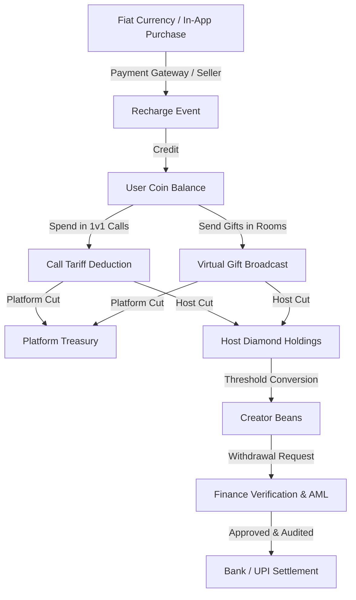

# Canonical Yaro Product Specification (Yaro Platform OS)

## 1. Executive Summary & Vision

The **Yaro Platform Operating System** is the unified enterprise control plane powering the Yaro live voice, video, social club, and micro-economy ecosystem. It comprises two synergistic panels:
1. **Yaro Platform Command Center (`YaroAdmin`)**: Governs platform-wide identity, security, immutable audit trails, finance command, executive visibility, live voice club diagnostics, and trust & safety enforcement.
2. **Yaro App Operations Center (`YaroAppManagement`)**: Powers application remote configuration, dynamic feature flags, mobile release pipelines (APK/AAB), digital asset studio (gifts, frames, VIP, levels), content CMS, and audience notification campaigns.

---

## 2. Canonical Product Entities & Relational Schema

| Entity | Description | Primary Key / Identifier | Relational Links |
| :--- | :--- | :--- | :--- |
| **User** | Core platform account holder consuming or producing content. | `_id: ObjectId` / `userCode: String` | `Wallet`, `HostProfile`, `Agency`, `SellerProfile`, `Reports`, `Sessions` |
| **Host** | Contracted or verified streamer/broadcaster eligible for gift monetization. | `_id: ObjectId` | Ref to `User`, `Agency`, `HostApplications`, `EarningsLedger` |
| **Agency** | Business syndicate managing a roster of verified hosts and receiving agency commission overrides. | `_id: ObjectId` | Ref to Owner `User`, `Hosts[]`, `CommissionSettlements` |
| **Seller** | Authorized regional coin reseller stocking diamond reserves to recharge end-user balances. | `_id: ObjectId` | Ref to `User`, `SellerWallet`, `StockPurchases`, `RetailRecharges` |
| **Operator / Staff** | Internal administrative personnel executing day-to-day platform actions. | `_id: ObjectId` | Ref to `User`, `Role`, `AuditEvents` |
| **Voice Club / Room** | Ephemeral or persistent audio-first stage for group live discussions, games, and gifting. | `_id: ObjectId` / `roomId: String` | Ref to `Host/Owner`, `Moderators[]`, `Participants[]`, `Gifts[]` |
| **Voice / Video Call** | 1-on-1 private peer-to-peer or routed audio/video communication channel. | `_id: ObjectId` / `channelName: String` | Ref to `Caller`, `Receiver`, `AgoraRTCChannel`, `CallDuration` |
| **Wallet** | Central balance ledger maintaining non-custodial digital asset holdings. | `_id: ObjectId` | Ref to `User`, `Coins`, `Diamonds`, `Beans` |
| **Coin** | Primary consumer currency purchased via fiat recharge to spend on calls and gifts. | `Number (Int64)` | Recharged via `PaymentGateway` or `Seller` |
| **Diamond** | Intermediate host appreciation currency credited upon receiving gifts. | `Number (Int64)` | Convertible to Beans or withdrawn |
| **Bean** | Redeemable creator currency backed by real-world cash settlements. | `Number (Int64)` | Redeemable via Bank Transfer / UPI |
| **Gift** | Animated virtual goods (SVGA/WebP/MP4) sent by users to hosts during calls or in rooms. | `_id: ObjectId` | Ref to `Category`, `CoinPrice`, `DiamondYield`, `SoundFX` |
| **VIP Tier** | Premium subscription status conveying badges, priority matching, and entry effects. | `_id: ObjectId` | Ref to `User`, `ExpiryDate`, `PrivilegeFlags` |
| **Badge / Frame** | Avatar cosmetic adornments signaling tenure, wealth, or event achievements. | `_id: ObjectId` | Ref to `User`, `AssetURL`, `AcquisitionCondition` |
| **Moderation Case** | Formal disciplinary investigation against abusive user, offensive room, or fraudulent payment. | `_id: ObjectId` | Ref to `TargetEntity`, `Reporter`, `Evidence[]`, `Timeline[]` |
| **Audit Event** | Cryptographically keyed, immutable transaction tracking privileged operator activity. | `_id: ObjectId` | Ref to `Actor`, `Role`, `Action`, `BeforeState`, `AfterState`, `Hash` |

---

## 3. Economy & Financial Lifecycle

### 3.1 Financial Invariants & Safety Mandates
1. **No Silent Balance Mutation**: Direct balance adjustments strictly require:
   - Reason justification (minimum 10 characters).
   - Dual-factor operator confirmation.
   - Recording of before and after snapshots.
   - Immediate generation of immutable audit event.
2. **Reconciliation Invariant**:
   $$\text{Opening Balance} + \sum \text{Recharges} - \sum \text{Spends} \pm \sum \text{Adjustments} \equiv \text{Closing Balance}$$

---

## 4. Role-Based Access Control (RBAC) Architecture

| Role | Scope | Permitted Capabilities | Prohibited Capabilities |
| :--- | :--- | :--- | :--- |
| **Super Admin / Owner** | Global Command | Unlimited access across all modules, sensitive configuration, and wallet balances. | Cannot bypass immutable audit trail logging. |
| **Admin** | Operations & IAM | User management, host approvals, content moderation, reports, and settings. | Direct database shell execution or signing key retrieval. |
| **Operator** | Live Support | Ticket processing, host onboarding review, user verification, KYC inspection. | Balance writebacks, fee alterations, destructive system config. |
| **Finance Officer** | Financial Operations | Ledger viewing, withdrawal approval, refund processing, reconciliation execution. | Modifying feature flags, banning users without justification. |
| **Moderator (Trust & Safety)** | Platform Integrity | Room closure, 1-on-1 call termination, text mute, device/ID ban enforcement. | Accessing payment provider credentials or adjusting coin balances. |
| **Content Manager** | App Operations | Banner scheduling, CMS documentation updates, gift asset metadata publishing. | Financial approvals or operator permission granting. |
| **Release Manager** | Release Operations | APK/AAB upload, checksum verification, release notes drafting, rollback triggering. | User moderation or wallet balance manipulation. |

---

## 5. Host & Agency Operational Lifecycles

### 5.1 Host Lifecycle
1. **Application**: Prospective host submits live selfie, government ID, voice sample, and language preferences.
2. **Review & Verification**: Operator verifies face match against KYC records via Face Verification Desk (`/verification/face`).
3. **Agency Assignment**: Host is either independent or linked to an accredited Agency ID.
4. **Active Broadcasting**: Host receives incoming 1-on-1 calls and initiates audio/video clubs.
5. **Auditing & Settlement**: Daily Diamond yield is calculated, agency commission is split, and net proceeds are queued for withdrawal.

### 5.2 Agency Syndicate Model
1. **Accreditation**: Agency applies with business registration documents via Agency Portal (`/agencies`).
2. **Roster Allocation**: Hosts bind to agency via referral code or direct admin binding.
3. **Commission Override**: Agency receives a configurable percentage ($5\% - 20\%$) of host gross diamond earnings.
4. **Performance Monitoring**: Real-time tracking of host broadcast hours, incoming call minutes, and aggregate revenue.

---

## 6. Trust & Safety, Moderation, and Security Lifecycles

1. **Detection & Ingestion**:
   - Automated keyword/sentiment analysis on room titles and chat messages.
   - User-generated abuse reports submitted via mobile client.
   - Rapid-disconnect call anomaly detection.
2. **Triage & Investigation Queue**:
   - Cases queued in Moderation Violations Queue (`/moderation/violations`).
   - Prioritized by severity: CSAM / Hate Speech / Harassment / Financial Fraud.
3. **Enforcement Actions**:
   - Level 1: Warning notification + temporary room mute.
   - Level 2: Immediate room termination + 24h host suspension.
   - Level 3: Permanent ID account ban (`/bans/id`) + Hardware Device Ban (`/bans/device`).
4. **Appeals Workflow**: Suspended user submits appeal, reviewed by a secondary operator with full audit documentation.

---

## 7. App Operations & Release Governance

1. **Artifact Verification**: All Android APK and AAB bundles must be cryptographically hashed (SHA-256) upon upload to `/app-releases`.
2. **Release Staging Pipeline**:
   $$\text{Draft} \longrightarrow \text{Internal Testing} \longrightarrow \text{Approved} \longrightarrow \text{Scheduled} \longrightarrow \text{Released} \longleftrightarrow \text{Rolled Back}$$
3. **Zero Tampering**: Platform signing keys are strictly managed via Android Keystore / CI/CD secrets; never stored in frontend code.
4. **Dynamic Remote Config**: Features can be rolled out progressively (0% to 100%) or halted instantly via emergency Kill Switch (`/feature-flags`).
